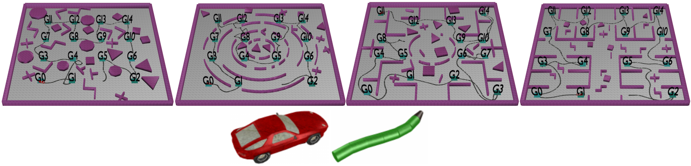

<p align="center">
  
  </p>


# DROMOS (Multi-Goal Motion Memory)
This project is the baseline named DROMOS for multi-goal motion memory, more details are described in the paper named "Multi-group motion planning in virtual environments"

## Language
This code is written in C++ 

## Requirements
Our experimental evaluation was conducted on a workstation with:

AMD Ryzen 9 5900X CPU (3.7 GHz)
Ubuntu 20.04 operating system
C++ implementation compiled with g++-9.4.0
Neural network models implemented in Python 3.8 with PyTorch 2.2.2

These specifications are recommendations; if you encounter any issues during setup, please contact us for assistance (ylu22@gmu.edu).

## Run Simulations
You still need to download the Treelite dependency (though it is not useful for baseline), otherwise, we cannot run the code


First, install the Treelite dependency from https://treelite.readthedocs.io/en/latest/

1. Download the treelite
```
git clone https://github.com/dmlc/treelite.git
cd treelite
mkdir build
cd build
cmake ..
cd ..
```

2. Build DROMOS
```
cd ..
./build.sh
```

3. Run Experiments
```
python GenerateResults.py --scene SCENE --planner PLANNER --grid GRID_SIZE
```
Parameters:
SCENE: "Random", "Curves", "Maze", and "Storage".
PLANNER: "Juve" or "RRT"
GRID_SIZE: 2, 3, 4
In this baseline, "Juve" represents "DROMOS", "RRT" represents "SequentialRRT"
```
python GenerateResults.py --scene Random --planner Juve --grid 2
```

4. Visualize Simulations
To visualize the scenarios, some manual operations are required. While I haven't implemented automatic map correspondence in C++ yet, I have completed this functionality in GenerateResults.py

You need to do the following:
Go to data/ change the obstacle info in ParamsSceneCurvesForCar.txt, see the line 8, change the file. For example, planner = Juve, grid = 3, obstacle id = 0
If you want to change the obstacle in Random, then go to ParamsSceneRandomForCar.txt

Run specific scenarios with visualization:
```
./bin/Runner GRunMP data/ParamsSceneCurvesForCar.txt ParamsExtraFile data/Instances/CurvesCarNrGrids3/0.txt MGMMPredictLabel data/PredictLabel/ UseMP Juve UseMap Curves PlannerStatsFile data/Results/JuveCurvesForCar_2.txt UseGrid 3 UseObstacle 0 TopNumber 5
```
Or try different environments:
```
./bin/Runner GRunMP data/ParamsSceneMazeForCar.txt ParamsExtraFile data/Instances/MazeCarNrGrids4/0.txt MGMMPredictLabel data/PredictLabel/ UseMP RRT UseMap Maze PlannerStatsFile data/Results/RRTMazeForCar_4.txt UseGrid 4 UseObstacle 0 TopNumber 5
```
When the visualization appears:
1. Right-click on "Motion Planner"
2. Select "solve repeat"
3. Click "animate solution" to view the path execution

You can modify parameters to test different scenarios:

Change environment: Replace Curves with Random, Maze, or Storage
Adjust grid size: Change grid parameter (2, 3, or 4)

For more configuration options, see GenerateResults.py. 

5. Clean Build Files

```
./clean.sh
```

6. Snake Model Configuration
To switch to the snake-like model, modify data/ParamsCar.txt:
Change from:

```
   CarBodyLength 2.00
   CarBodyWidth  0.9
   CarNrTrailers 0
```

to 
```
   CarBodyLength 0.66
   CarBodyWidth  0.5
   CarNrTrailers 3
```

### Contribution
If you would like to contribute to this project, feel free to submit a pull request or open an issue on GitHub.

### License
This project is licensed under the MIT License. See the LICENSE file for details

### Contact
For any questions or support, please contact:
📧 Yuanjie Lu - ylu22@gmu.edu